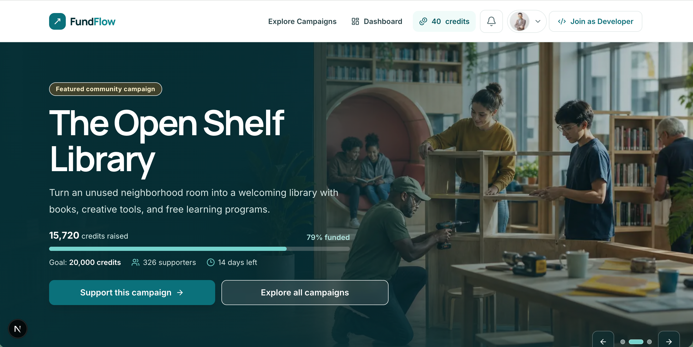
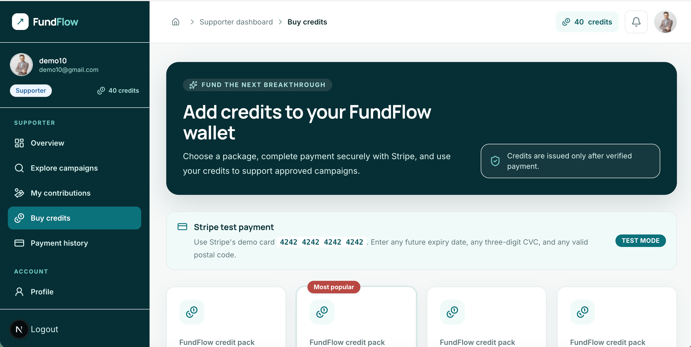
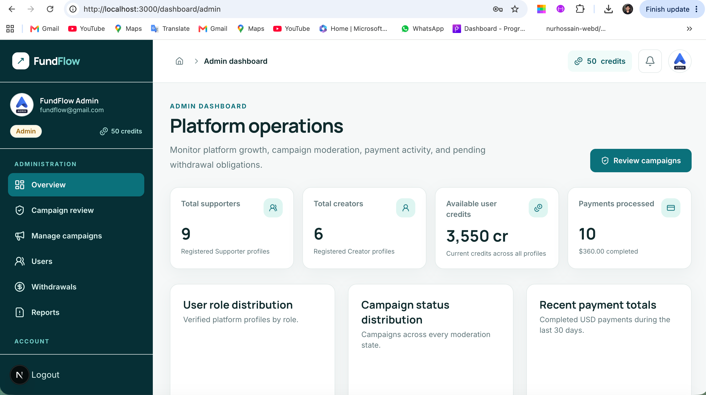

# FundFlow

FundFlow is a full-stack crowdfunding platform where creators launch campaigns, supporters contribute platform credits, and administrators moderate campaigns, users, withdrawals, and reports.

## Live application

- Live site: [https://fund-flow-client.vercel.app](https://fund-flow-client.vercel.app)
- Client repository: [FundFlow-client](https://github.com/nurhossain-webd/FundFlow-client)
- Server repository: [FundFlow-server](https://github.com/nurhossain-webd/FundFlow-server)
- API health: [FundFlow API health](https://fund-flow-server-ten.vercel.app/api/v1/health)
- Developer portfolio: [Hossain Riyad](https://nurhossainportfolio.vercel.app)
- LinkedIn: [Hossain Riyad](https://www.linkedin.com/in/hossain-riyad)

## Admin access

- Admin email: `fundflow@gmail.com`
- Admin password: `Fundflow@gmail.com1`

## Screenshots

### Homepage



### Supporter dashboard



### Admin dashboard



## Features

- Email/password registration and login with strong form validation.
- Google authentication through Better Auth.
- Persistent authenticated sessions and private-route restoration after refresh.
- Three server-authorized roles: Supporter, Creator, and Admin.
- One-time starting balances of 50 Supporter credits and 20 Creator credits.
- Responsive public pages and role-specific mobile, tablet, and desktop dashboards.
- Animated homepage with campaign hero slider, top-funded campaigns, categories, impact statistics, and testimonial slider.
- Campaign discovery, filtering, details, deadlines, funding progress, and minimum contribution rules.
- Creator campaign creation with imgBB cover-image uploading, editing, and transactional deletion refunds.
- Supporter contributions with pending, approved, rejected, and refunded states.
- Paginated contribution history with search and status filtering.
- Creator contribution review with approval and rejection workflows.
- Stripe Checkout credit purchases with verified, idempotent webhook processing.
- Trusted server-side credit packages and Supporter payment history.
- Creator withdrawal requests using the 20-credits-to-$1 conversion and 200-credit minimum.
- Admin campaign approvals, user management, withdrawal processing, campaign moderation, and reports.
- In-app notifications for campaign, contribution, payment, withdrawal, and moderation events.
- Secure role middleware, ownership validation, rate limiting, security headers, and MongoDB transactions.

## Technology

- Next.js 16 and React 19
- TypeScript
- Tailwind CSS
- TanStack Query
- Better Auth
- React Hook Form and Zod
- Swiper and Framer Motion
- Stripe Checkout
- MongoDB
- imgBB

## Local setup

Requirements:

- Node.js 24
- npm
- A MongoDB database
- Google OAuth credentials
- imgBB API key
- Stripe test credentials

```bash
git clone https://github.com/nurhossain-webd/FundFlow-client.git
cd FundFlow-client
npm install
cp .env.example .env.local
npm run dev
```

Configure `.env.local` before starting:

```env
BETTER_AUTH_SECRET=
BETTER_AUTH_URL=http://localhost:3000
MONGODB_URI=
MONGODB_DB_NAME=fundflow
GOOGLE_CLIENT_ID=
GOOGLE_CLIENT_SECRET=
IMGBB_API_KEY=
NEXT_PUBLIC_APP_URL=http://localhost:3000
NEXT_PUBLIC_API_URL=http://localhost:4000/api/v1
NEXT_PUBLIC_STRIPE_TEST_MODE=true
NEXT_PUBLIC_CLIENT_REPOSITORY_URL=https://github.com/nurhossain-webd/FundFlow-client
```

Start the Express API separately from the server repository on port `4000`.

## Scripts

```bash
npm run dev
npm run typecheck
npm run lint
npm run build
npm run start
```

## Security note

Never commit `.env.local`, MongoDB credentials, OAuth secrets, Stripe keys, session tokens, or Admin passwords outside the assessment credential section.
